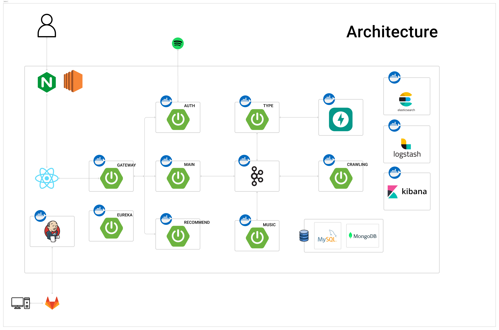
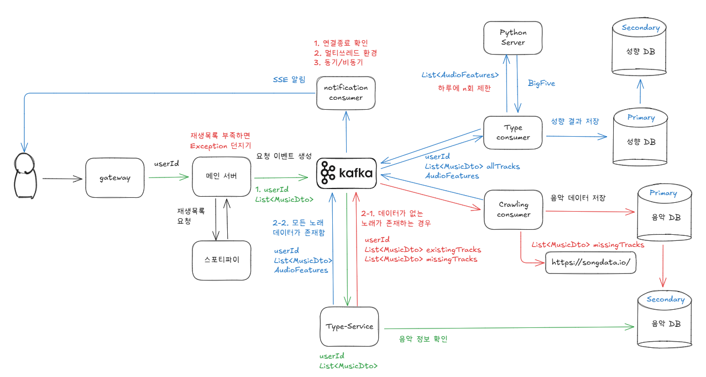

# MusicNote

## 프로젝트 소개
- 당신이 듣는 음악이 당신을 말하다. 유저들이 들은 음악을 바탕으로 사람들의 성향을 분석하고, 성향에 어울리는 크로스 도메인을 추천하는 프로젝트입니다.

### 배포 주소
- ~~https://j12a308.p.ssafy.io/~~

## 주요 기능
1. Spotify API를 활용하여 최근 들은 음악을 기준으로 성향을 분석합니다.
2. 분석한 성향 (Big Five 기반)을 일간, 주간 기준으로 레포트를 제공합니다.
3. 분석한 성향을 바탕으로 유저가 좋아할만한 영화와 음악을 추천합니다.

## 시스템 구성도

## 기술 스택
### Frontend
- React
- TypeScript
- Tailwind.css

### Backend
- Java 17, Spring Boot
- Kafka 3.7 (KRaft 기반)
- MySQL, MongoDB

### DataAnalysis
- Fast API
- Pytorch
- scikit-learn

## 팀원 소개
- 프론트엔드: 민경현, 주현호
- 백엔드(서버): 문인규, 손승범
- 백엔드(데이터분석): 남기운, 윤상흠

## 트러블 슈팅
### Back-End (Server)
#### 1. 사용자의 성향 분석 요청 처리하기

- **문제 상황**
    - 성향 분석 요청은 **여러 서비스에 걸쳐 수행**되므로, 이를 **동기적으로 처리**할 경우 다양한 문제가 발생
    - 하나의 서비스가 **지연되거나 실패**하면 전체 처리가 지연되거나 실패로 이어질 수 있음
    - **높은 트래픽 상황**에서는 모든 요청을 **실시간으로 처리하기 어려워** 시스템 부하가 가중됨
    - 서비스 간 **동기 호출 기반의 강한 결합도**로 인해 **유지보수 및 확장성에 한계** 발생
- **문제 해결**
    - **Kafka 기반 비동기 이벤트 스트리밍 구조**로 전환
        - 메인 서버는 사용자 요청을 **Kafka 이벤트로 발행**하고, 이후 **각 서비스가 독립적으로 수행**
    - 사용자에게 **비동기 알림** 제공을 위해 **SSE(Server-Sent Events)** 도입
        - **브라우저 기반 단방향 통신**에 적합하며, 실시간 처리가 필요한 알림에 적절
- **결과**
    - **이벤트 기반 아키텍처 설계를** 통해 서비스 간 결합도를 낮춤
    - 서비스가 **비동기적으로** 동작함에 따라 **높은 트래픽** 상황에서도 안정적인 **성능 유지**
- **관련 포스팅**
    - https://bangbaeking.tistory.com/163

